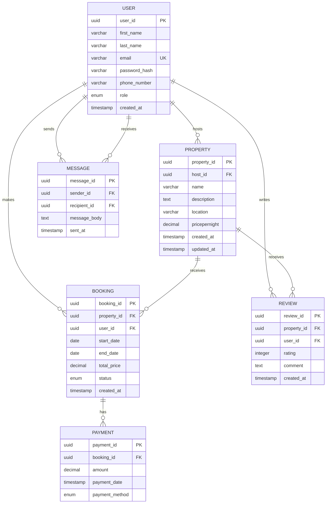

# Airbnb Database Entity-Relationship Diagram

## Mermaid ERD

## Entity Descriptions

### User Entity
- **Primary Key**: user_id (UUID)
- **Unique Key**: email
- **Role**: Can be guest, host, or admin
- **Relationships**: 
  - One-to-Many with Property (as host)
  - One-to-Many with Booking (as guest)
  - One-to-Many with Review (as reviewer)
  - One-to-Many with Message (as sender and recipient)

### Property Entity
- **Primary Key**: property_id (UUID)
- **Foreign Key**: host_id references User(user_id)
- **Relationships**:
  - Many-to-One with User (host)
  - One-to-Many with Booking
  - One-to-Many with Review

### Booking Entity
- **Primary Key**: booking_id (UUID)
- **Foreign Keys**: 
  - property_id references Property(property_id)
  - user_id references User(user_id)
- **Status**: pending, confirmed, or canceled
- **Relationships**:
  - Many-to-One with User (guest)
  - Many-to-One with Property
  - One-to-Many with Payment

### Payment Entity
- **Primary Key**: payment_id (UUID)
- **Foreign Key**: booking_id references Booking(booking_id)
- **Payment Methods**: credit_card, paypal, stripe
- **Relationships**:
  - Many-to-One with Booking

### Review Entity
- **Primary Key**: review_id (UUID)
- **Foreign Keys**:
  - property_id references Property(property_id)
  - user_id references User(user_id)
- **Rating**: Integer between 1 and 5
- **Relationships**:
  - Many-to-One with User (reviewer)
  - Many-to-One with Property

### Message Entity
- **Primary Key**: message_id (UUID)
- **Foreign Keys**:
  - sender_id references User(user_id)
  - recipient_id references User(user_id)
- **Relationships**:
  - Many-to-One with User (sender)
  - Many-to-One with User (recipient)

## Key Constraints

1. **Email Uniqueness**: Each user must have a unique email address
2. **Rating Validation**: Review ratings must be between 1 and 5
3. **Status Validation**: Booking status must be one of: pending, confirmed, canceled
4. **Payment Method Validation**: Payment method must be one of: credit_card, paypal, stripe
5. **Role Validation**: User role must be one of: guest, host, admin

## Indexes

- **Primary Keys**: Automatically indexed
- **Foreign Keys**: property_id, user_id, booking_id
- **Unique Keys**: email
- **Additional Indexes**: For performance optimization on frequently queried fields
